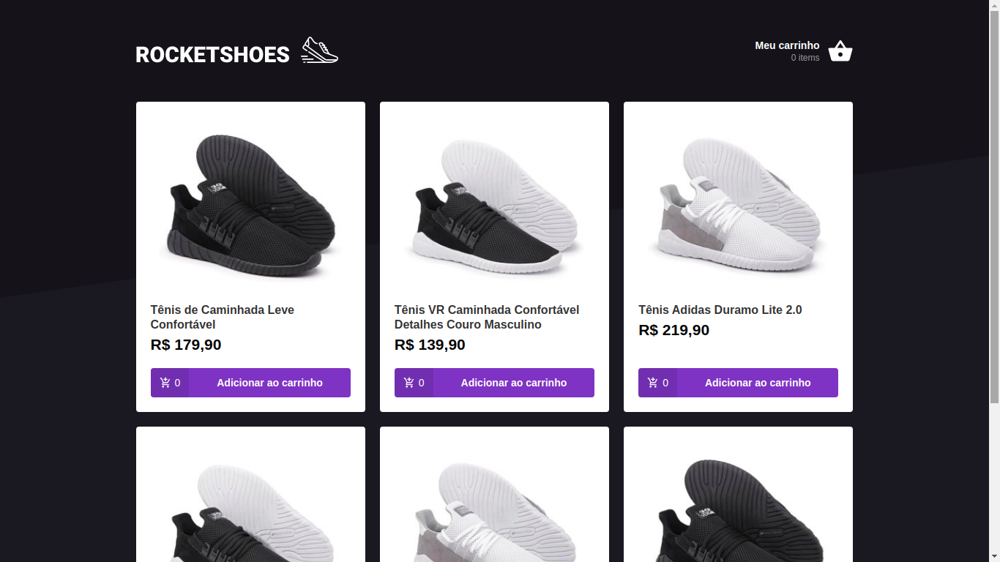

<h1 align="center">ROCKETSHOES</h1>

  

  

  

  

  

 Projeto feito através do bootcamp da rocketseat

  

# Objetivos

Este projeto foi realizado com o intuito de fixar conceitos do react e também aprender mais sobre o redux e seus conceitos aplicando técnicas e usando uma estrutura escalável pra projetos front-end.

# Tech

- Node.js
- React.js
- Json server

# Rodando o projeto

- Rode o comando `yarn install` na pasta do projeto;
- Execute o comando `yarn json-server server.json -p 3333` para rodar o servidor fake
- Rode o comando `yarn start`;
